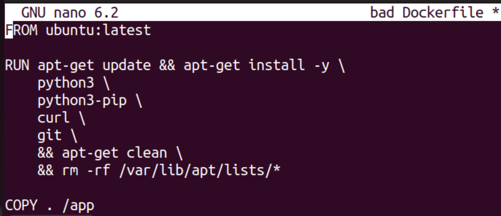

# Лабораторная работа №2 (обычная)
Что надо сделать:
1. Написать “плохой” Dockerfile, в котором есть не менее трех “bad practices” по написанию докерфайлов
2. Написать “хороший” Dockerfile, в котором эти плохие практики исправлены
3. В Readme описать каждую из плохих практик в плохом докерфайле, почему она плохая и как в хорошем она была исправлена, как исправление повлияло на результат
4. В Readme описать 2 плохих практики по работе с контейнерами. ! Не по написанию докерфайлов, а о том, как даже используя хороший докерфайл можно накосячить именно в работе с контейнерами.

## "Плохой" Dockerfile:

1. **Использование `latest` тега**
   Это небезопасно, так как версия образа может обновиться и сломать совместимость окружения.

2. **Неоптимизация слоев**
   Каждый вызов `RUN`, `COPY` создает новый слой, что увеличивает размер образа.

3. **Неочищенный кэш после установки зависимостей**
   В "плохом" Dockerfile сохраняется кэш, что увеличивает размер образа.
   
  
## "Хороший" Dockerfile:

1. **Использование `latest` тега**
   - Это небезопасно, так как версия образа может обновиться и сломать совместимость окружения.
   - В "хорошем" Dockerfile мы используем конкретную версию (`python:3.9-slim`), что гарантирует стабильность.

2. **Неоптимизация слоев**
   - Каждый вызов `RUN`, `COPY` создает новый слой, что увеличивает размер образа.
   - Мы объединили команды в один слой и установили зависимости до копирования кода, что ускоряет сборку.

3. **Неочищенный кэш после установки зависимостей**
   - В "плохом" Dockerfile сохраняется кэш, что увеличивает размер образа.
   - В "хорошем" Dockerfile используется флаг `--no-cache-dir` для очистки временных файлов.
     

## Плохие практики при работе с контейнерами:

1. **Запуск контейнера с root-привилегиями**
   - Это небезопасно, так как компрометация контейнера может привести к компрометации всей системы. Лучше запускать контейнеры от непривилегированных пользователей.

2. **Запуск нескольких сервисов в одном контейнере**
   - Это нарушает принцип контейнеризации "один контейнер — один процесс". Лучше разделять сервисы на отдельные контейнеры для управления и изоляции.
